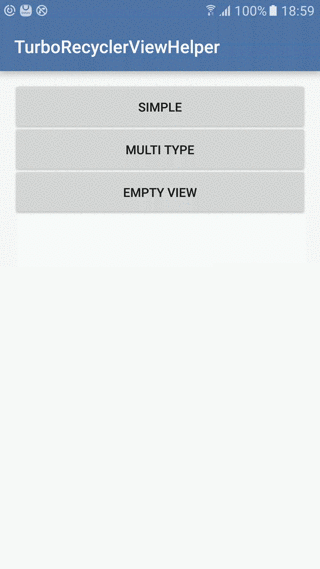
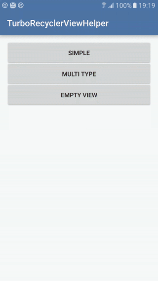

TurboRecyclerViewHelper project
===============================

>* **[实现RecyclerView的功能扩展](http://solart.cc/2016/06/01/turbo-recyclerview-helper-1/)**

Travis master: [](https://travis-ci.org/Solartisan/TurboRecyclerViewHelper)

一个强大并且灵活的RecyclerView库。欢迎大家使用（如果您喜欢，希望您能star一下，你的支持对我来说是巨大的动力）


有哪些功能（[download apk](https://github.com/Solartisan/TurboRecyclerViewHelper/raw/master/preview/turbo_demo.apk)）
-----------------------------------------------------------------------------------------------------------------
* **上拉/左滑加载更多**
	* 为什么不做下拉刷新？因为有太多强大而炫酷的下拉刷新控件，目前针对RecyclerView的上拉加载大都没有拖拽过渡效果，所以针对这种情况实现了有过渡效果的上拉加载部分的实现
* **支持设置EmptyView**
	* 在数据为null时显示一个EmptyView提示用户（类似ListView.setEmptyView）
* **支持添加Header和Footer** 
* **支持添加点击事件和长按事件**
	* 通过给item添加点击事件实现(1.0.2之前版本通过OnItemTouch方案实现，但存在没有点击效果的bug，如有更好的方案劳烦告知。)
* **支持自定义加载Footer**
	* 可以通过自定义自己应用的加载效果
* **支持加载数据库数据**
    * 可配合CursorLoader加载Cursor




Gradle
---
```
dependencies {
    ...
    compile 'cc.solart:turbo-recyclerview-helper:1.1.0'
}
```

如何使用
---
#### **在布局文件中添加`TurboRecyclerView`**

```xml
    <cc.solart.turbo.TurboRecyclerView
        android:id="@+id/rv_list"
        android:layout_width="match_parent"
        android:layout_height="match_parent"
        app:maxDragDistance="100"
        app:enableLoad="true" />
```

#### **创建一个简单的适配器继承于`BaseTurboAdapter`**

```java
public class SimpleAdapter extends BaseTurboAdapter<String, SimpleAdapter.SimpleViewHolder> {
    
    public SimpleAdapter(Context context) {
        super(context);
    }

    public SimpleAdapter(Context context, List<String> data) {
        super(context, data);
    }

    @Override
    protected SimpleViewHolder onCreateDefViewHolder(ViewGroup parent, int viewType) {
        return new SimpleViewHolder(inflateItemView(R.layout.item_simple, parent));
    }

    @Override
    protected void convert(SimpleViewHolder holder, String item) {
        holder.tv.setText(item);
    }


    class SimpleViewHolder extends BaseViewHolder {

        TextView tv;

        protected SimpleViewHolder(View view) {
            super(view);
            tv = findViewById(R.id.simple_text);
        }
    }
}
```

#### **添加Header和Footer**

```java
        mAdapter = new SimpleAdapter(this, Arrays.asList(sCheeseStrings));
        View header = LayoutInflater.from(this).inflate(R.layout.item_header, (ViewGroup) mRecyclerView.getParent(), false);
        mAdapter.addHeaderView(header);
        View footer = LayoutInflater.from(this).inflate(R.layout.item_footer, (ViewGroup) mRecyclerView.getParent(), false);
        mAdapter.addFooterView(footer);
        mRecyclerView.setAdapter(mAdapter);
        mRecyclerView.setLoadMoreEnabled(true);
```

#### **添加点击和长按事件**
        
```java
        mAdapter.addOnItemClickListener(new OnItemClickListener() {
            @Override
            public void onItemClick(RecyclerView.ViewHolder vh, int position) {
                Toast.makeText(SimpleActivity.this, "您点击了第" + position + "个item", Toast.LENGTH_SHORT).show();
            }
        });
```

#### **允许启用上拉加载以及添加监听事件**

```java
		mRecyclerView.setLoadMoreEnabled(true);//or use enableLoad in xml
    	mRecyclerView.addOnLoadingMoreListener(new OnLoadMoreListener() {
            @Override
            public void onLoadingMore() {
                handler.postDelayed(new Runnable() {
                    @Override
                    public void run() {
                        mRecyclerView.loadMoreComplete(Arrays.asList(sCheeseStrings));
                    }
                }, 2000);
            }
   	    });
```

更新日志
---
* **1.0.0-beta**
    * Initial release
* **1.0.1-beta**
    * 添加styleable属性
* **1.0.2-beta**
    * 修复EmptyView显示时仍可上拉的bug
    * 修改Item点击和长按的实现方案
* **1.0.3-beta**
    * 修复遗漏的泛型值
* **1.0.4-beta**
    * 修复在检测是否为空状态时类型转换异常的bug
* **1.0.5-beta**
    * 修复调用者setSpanSizeLookup被覆盖(这意味着你必须自己处理GridLayoutManager中FullSpan的类型)
* **1.0.6-beta**
    * 修复在不能滑动的方向上Touch事件处理引起的异常刷新
* **1.0.7-beta**
    * 修复itemView为AdapterView时注册点击事件抛出异常
* **1.0.8-beta**
    * 修复滑动到底部不响应点击事件的bug
* **1.0.9-beta**
    * 添加removeData(List<T> data)方法
* **1.1.0**
    * 重构Adapter，新增BaseCursorAdapter
      
感谢
---
[base-adapter-helper](https://github.com/JoanZapata/base-adapter-helper)

[RecyclerItemDecoration](https://github.com/dinuscxj/RecyclerItemDecoration)
    
许可
---

    Copyright 2015 - 2016 solartisan/imilk

    Licensed under the Apache License, Version 2.0 (the "License");
    you may not use this file except in compliance with the License.
    You may obtain a copy of the License at

        http://www.apache.org/licenses/LICENSE-2.0

    Unless required by applicable law or agreed to in writing, software
    distributed under the License is distributed on an "AS IS" BASIS,
    WITHOUT WARRANTIES OR CONDITIONS OF ANY KIND, either express or implied.
    See the License for the specific language governing permissions and
    limitations under the License.